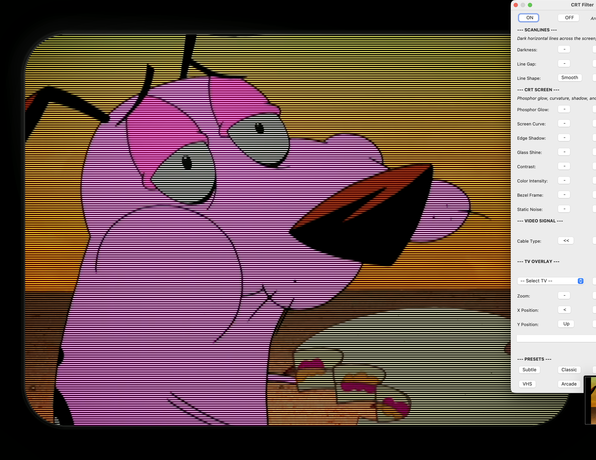

# CRT Emulator for VLC

A native CRT simulation filter for VLC media player. Scanlines, phosphor glow, NTSC color bleed, screen curvature, TV overlays, and more — all adjustable in real time.

Supports **macOS** (Apple Silicon + Intel) and **Linux** (x86_64).

| Original | With CRT Emulator |
|:---:|:---:|
|  |  |

| Scanlines + Phosphor | Full CRT (Curvature + Scanlines + NTSC) |
|:---:|:---:|
|  |  |

| With TV Overlay |
|:---:|
|  |

---

## Quick Start (macOS)

```bash
git clone https://github.com/itsdunintime104/VLC-CRT-emulator-plugin.git
cd VLC-CRT-emulator-plugin
sudo ./setup.sh
```

Then open VLC:
1. **Preferences** (Cmd+,) > **Show All** > Video > Filters > check **CRT Emulator video filter** > Save
2. Restart VLC
3. **Extensions** > **CRT Emulator** > **Show Controller**

Or launch directly: `open -a VLC --args --video-filter=crtemulator "video.mp4"`

---

## What It Does

This plugin transforms your video to look like it's playing on a real CRT television from the 80s/90s. Every effect can be toggled independently and adjusted in real time.

### Scanlines
Dark horizontal lines across the screen — the defining visual feature of CRT displays. Three styles: **smooth** (gentle sine-wave fade between bright and dark), **hard** (sharp alternating lines), or **black** (every other line fully black, like an arcade monitor). Darkness and gap width are adjustable. Lines auto-scale to video resolution so they look correct at any size.

### Phosphor Glow
On a real CRT, the phosphor coating glows when hit by the electron beam. This effect brightens the visible lines between the dark scanline gaps, making the image look warm and "lit from within" rather than just having dark stripes painted on top.

### NTSC Signal Simulation
Simulates the analog video signal path from console to TV. Four modes:
- **Off** — clean digital, no artifacts
- **S-Video** — slight rightward color smear (luma and chroma travel on separate wires, but chroma bandwidth is still limited)
- **Composite** — rainbow color fringes on fine detail + dot crawl pattern on color edges (luma and chroma share one wire, causing crosstalk)
- **RF** — maximum color bleed across the image (worst signal quality, like using an antenna)

Noise (analog static/grain) is an independent control that can be combined with any signal mode or used alone.

### Screen Curvature
Barrel distortion bends the image outward like the curved glass of a CRT tube. Adjustable from subtle to fishbowl.

### Vignette
Darkens the edges and corners of the screen, simulating how the electron beam loses intensity toward the edges of a CRT tube.

### Bezel Frame
A procedural dark border around the video with rounded corners and 3D depth shading — the plastic housing of a CRT television. Top and left edges are lighter (catching light), bottom and right are darker (in shadow).

### Glass Reflection
A soft light glow in the upper-left area of the screen, simulating overhead room light reflecting off the curved CRT glass. Applied as the final rendering pass so it illuminates both the video content and the TV frame/bezel edges.

### TV Background Overlays
Load a PNG image of a real TV set — the video plays inside the TV screen while the frame, desk, and wall are visible around it. 15 overlays bundled from retro consoles (NES, SNES, Genesis, PlayStation, and more), all selectable from a dropdown menu. The video automatically scales to fit the screen area with adjustable zoom, X/Y position, and anti-aliased edges. Screen curvature is auto-set when loading an overlay.

> **Note:** Each overlay template has a slightly different screen position. The bundled presets provide a good starting point, but you may need to fine-tune the **Zoom**, **X**, and **Y** controls in the GUI to perfectly align the video with a specific TV model.

### Contrast & Saturation
Contrast makes darks darker and brights brighter (below 100 = washed out, above 100 = punchy). Saturation controls color intensity (0 = black & white, 100 = normal, above 100 = vivid).

### Live GUI Controller
All parameters are adjustable in real time through a VLC Lua extension (**Extensions > CRT Emulator > Show Controller**). Clean 4-column layout with descriptive value labels, a dropdown TV overlay selector, and 6 one-click presets (Subtle, Classic, Heavy, 90s Anime, VHS Tape, Arcade).

---

## Presets

| Preset | Style |
|:-------|:------|
| **Subtle** | Barely visible scanlines, clean image |
| **Classic** | Standard CRT scanline look |
| **Heavy** | Pronounced hard scanlines |
| **90s Anime** | Warm glow + S-Video bleed for broadcast anime |
| **VHS Tape** | Washed out, heavy bleed, light noise |
| **Arcade** | Black scanlines, strong phosphor, curved screen |

---

## TV Overlays

15 TV backgrounds from [Soqueroeu TV Backgrounds](https://github.com/soqueroeu/Soqueroeu-TV-Backgrounds_V2.0), selectable from a dropdown in the GUI:

Generic (Gray, White, CRT Monitor, Flat) · Nintendo (NES, SNES, N64, Famicom) · Sega (Genesis, Master System, Dreamcast) · SNK Neo Geo · Sony (PlayStation, PS2)

Each overlay auto-sets screen curvature and positions the video inside the TV screen. Adjust with Zoom, X, and Y controls.

---

## Install

### macOS

Requires [Xcode Command Line Tools](https://developer.apple.com/xcode/) and [VLC 3.0.x](https://www.videolan.org/vlc/).

```bash
sudo ./setup.sh
```

Builds the plugin, installs it + the Lua controller + all 15 overlays into VLC.

### Linux

```bash
./build_macos.sh   # Same build script works — downloads VLC SDK headers
sudo cp build/libcrt_scanline_plugin.so /usr/lib/vlc/plugins/video_filter/
sudo cp lua/crt_scanline_controller.lua /usr/lib/vlc/lua/extensions/
sudo cp overlays/*.png /usr/share/vlc/crt-overlays/
```

Note: Linux build is untested. The C source is portable (C99 + VLC plugin API). Contributions welcome.

---

## Technical Overview

Single C99 source file (`crt_scanline.c`, ~1600 lines) with a 6-pass per-frame pipeline:

1. **Barrel distortion** — coordinate remap on all YUV planes
2. **NTSC luma artifacts** — dot crawl from chroma→luma crosstalk
3. **NTSC chroma + saturation** — IIR lowpass bleed + Y/C crosstalk
4. **Luma effects** — scanlines, phosphor, vignette, contrast, noise, bezel
5. **TV overlay** — PNG compositing with zoom-rectangle and anti-aliased edges
6. **Glass reflection** — additive glow over the final composited output

PNG loading via [stb_image.h](https://github.com/nothings/stb) (public domain). All parameters live-adjustable via VLC's config system.

---

## Credits & Acknowledgments

This project builds on the work of several open-source contributors:

**Jules Lazaro** ([@julescools](https://github.com/julescools)) — created the original [VLC-CRT-emulator-plugin](https://github.com/julescools/VLC-CRT-emulator-plugin): the first native CRT scanline filter for VLC, including the C99 plugin architecture, resolution-aware scaling, Lua controller, and Windows build system. This fork would not exist without that foundation.

**sprash3** — barrel distortion formula from the [vt220 Shadertoy shader](https://www.shadertoy.com/view/XdtfzX). The `r·uv/sqrt(r²-|uv|²)` curvature approach was adapted into C with pixel-center coordinates and per-plane YUV handling.

**blargg** (Shay Green) — the NTSC simulation approach was researched from [snes_ntsc](http://blargg.8bitalley.com/libs/ntsc.html) (LGPL 2.1). IIR coefficient structure and Y/C crosstalk concept informed our design. Implementation is entirely original — no blargg code is present.

**Filippo Scognamiglio** ([cool-retro-term](https://github.com/Swordfish90/cool-retro-term)) — bezel frame and glass reflection design inspired by the TerminalFrame shader (GPL v3). No code copied; implementation is original.

**Soqueroeu** — TV background overlay images from [Soqueroeu-TV-Backgrounds V2.0](https://github.com/soqueroeu/Soqueroeu-TV-Backgrounds_V2.0). See [OVERLAYS_LICENSE.txt](OVERLAYS_LICENSE.txt) for their terms.

**Sean Barrett** — [stb_image.h](https://github.com/nothings/stb) PNG decoder (public domain).

**HyperspaceMadness** — the [Mega Bezel Reflection Shader](https://github.com/HyperspaceMadness/Mega_Bezel) for RetroArch informed our glass reflection architecture (PASS 6 additive approach).

### What's new in this fork

The macOS port and every feature beyond the original scanline filter is new work: phosphor glow, NTSC signal simulation (IIR lowpass + Y/C crosstalk + dot crawl), barrel distortion, vignette, procedural bezel frame (SDF mask), glass reflection, contrast/saturation, analog noise, and the complete TV overlay system (stb_image PNG loading, zoom-rectangle compositing, per-overlay presets, AR-aware cropping, anti-aliased edges, dropdown selector). The Lua GUI controller was rewritten with live parameter adjustment, dynamic descriptions, and 6 presets.

---

## Support

If you enjoy this plugin, consider supporting development:

[](https://buymeacoffee.com/itdunintime)

**Crypto donations:**

| Currency | Address |
|:---------|:--------|
| BTC | `1A7DmUpKRkuoSTKkWDcFR6SBdtpGqa1R8x` |
| ETH | `0x772a320ff05c763eae76868b971b6d53daee36e7` |
| SOL | `En858GF2YnTtTo4rmGfdTADof5gdVMGv1d13favtAbS5` |
| USDT (ERC-20) | `0x772a320ff05c763eae76868b971b6d53daee36e7` |

---

## License

Plugin source code: **LGPL v2.1+** (same as VLC).

TV overlay images: Soqueroeu's custom terms (free with attribution; commercial use requires permission). See [OVERLAYS_LICENSE.txt](OVERLAYS_LICENSE.txt).

stb_image.h: **Public domain**.
